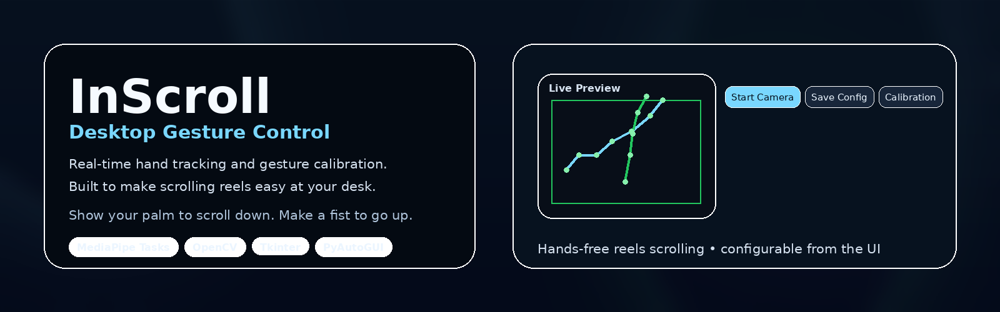
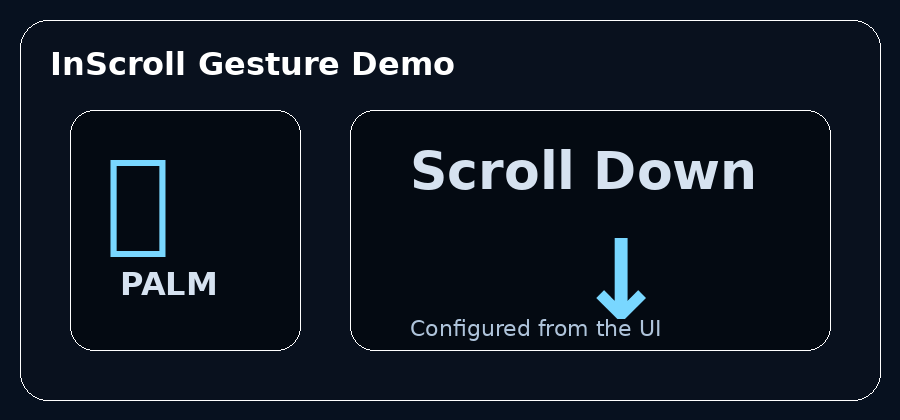
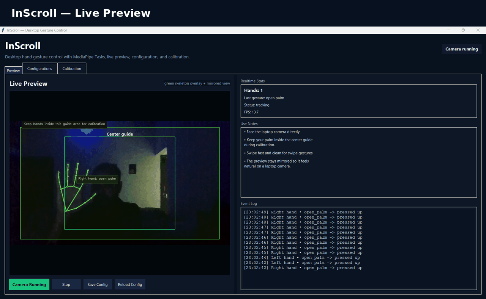
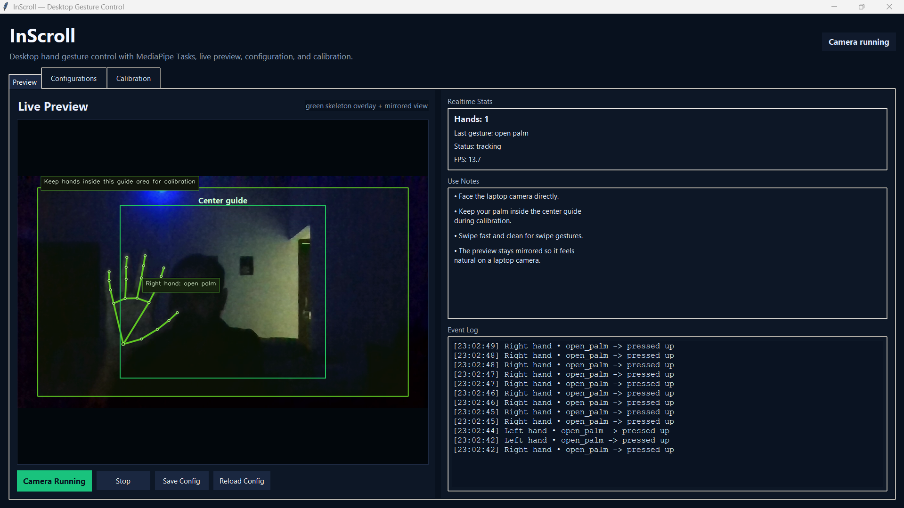
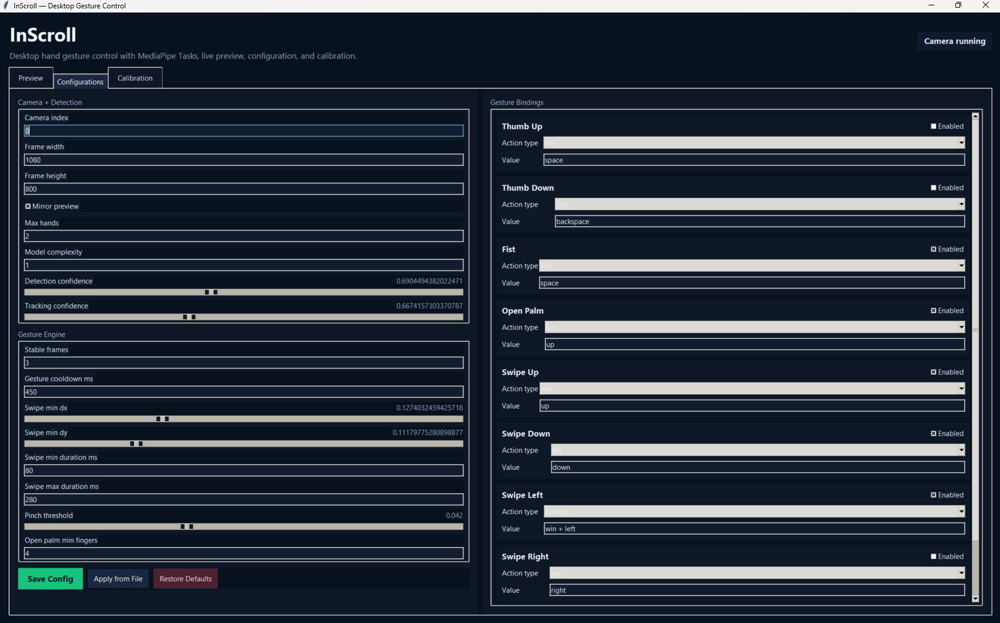
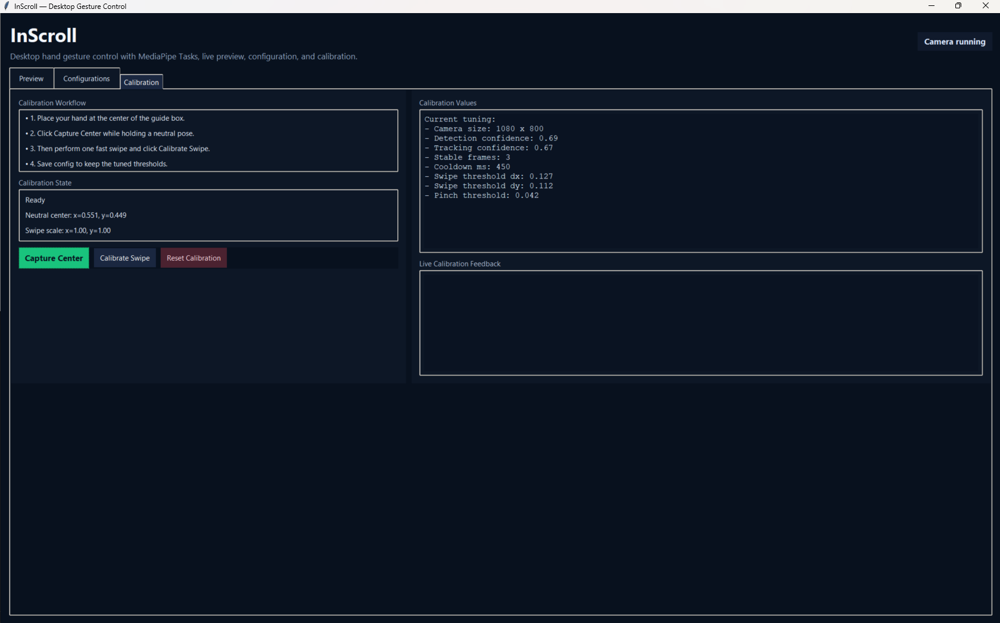

# InScroll 👋🖐️

<div align="center">



# Desktop Gesture Control for Smooth Reels Scrolling

**Real-time hand tracking • gesture calibration • desktop automation • configurable bindings**


<!-- Replace BOSS294/InScroll with your GitHub repository path to activate these repository badges -->
[](https://github.com/BOSS294/InScrollgraphs/contributors)
[](https://github.com/BOSS294/InScroll)
[](https://github.com/BOSS294/InScrollcommits/main)

</div>

---

## Why InScroll exists

InScroll started from a very real desk problem.

I wanted to watch Instagram Reels on desktop during breaks, but I was sitting in a relaxed position and scrolling with the arrow keys or mouse wheel felt slow and awkward. The app login flow was also inconvenient, so I leaned into the desktop experience instead.

The result was a hand-gesture controller that lets me keep sipping coffee, stay comfortable, and simply use a palm or fist to control scrolling and other actions from the webcam.

That idea became InScroll: a practical desktop gesture-control app built for fast, natural interaction.

---

## What InScroll does

InScroll turns a webcam into a touchless control system for the desktop.

It uses MediaPipe hand landmarks, OpenCV video capture, gesture classification, configurable bindings, calibration tools, and PyAutoGUI actions to detect gestures and trigger real keyboard or hotkey events locally.

It is designed for:

- Smooth Instagram Reels scrolling on desktop
- Productivity shortcuts
- Accessibility workflows
- Presentations
- Media control
- Computer vision experiments
- Human-computer interaction demos

---

## Primary use case

The core idea behind the project is simple:

- Sit back
- Keep your hand in a relaxed position
- Show your palm to scroll down
- Make a fist to scroll up
- Tune the timing and thresholds from the UI

Everything important can be adjusted from the **Configurations** and **Calibration** tabs.

---

## Demo

### Gesture concept



### UI tour



---

## Screenshots

### Live Preview



### Configurations



### Calibration



---

## Highlights

### Real-time hand tracking

- MediaPipe Hand Landmarker integration
- Left and right hand support
- Landmark-based finger analysis
- Live skeleton overlay
- Mirrored preview for natural laptop use

### Gesture recognition engine

Recognizes these gestures:

- Thumb Up
- Thumb Down
- Fist
- Open Palm
- Swipe Up
- Swipe Down
- Swipe Left
- Swipe Right
- Pinch

### Stable triggering

To avoid accidental actions, InScroll uses:

- Stable frame validation
- Gesture cooldown timing
- Swipe duration windows
- Distance thresholds
- Pinch thresholds
- Open-palm finger count checks

### Desktop automation

Gesture actions can trigger:

- Single key presses
- Hotkeys
- Scroll actions
- Navigation shortcuts
- Custom desktop workflows

### Calibration tools

The calibration system helps tune the app for:

- Different webcams
- Different lighting
- Different hand sizes
- Different desk distances
- Different sitting positions

### Auto model management

If the MediaPipe hand model is missing, the app can download it automatically and store it locally in `models/hand_landmarker.task`.

### Python 3.14 compatibility patching

The project includes a compatibility patch for MediaPipe so newer Python versions can keep working more smoothly.

---

## UI overview

### Preview tab

The Preview tab is the main dashboard.

It shows:

- Live webcam feed
- Green skeleton overlay
- Realtime hand count
- Last detected gesture
- Tracking status
- FPS
- Event log
- Start/Stop controls
- Save/Reload config buttons

It also includes a center guide for calibration and short usage notes.

### Configurations tab

The Configurations tab exposes the full tuning surface:

**Camera + Detection**
- Camera index
- Frame width
- Frame height
- Mirror preview
- Max hands
- Model complexity
- Detection confidence
- Tracking confidence

**Gesture Engine**
- Stable frames
- Gesture cooldown ms
- Swipe minimum dx
- Swipe minimum dy
- Swipe minimum duration ms
- Swipe maximum duration ms
- Pinch threshold
- Open palm minimum fingers

**Gesture bindings**
Each gesture can be configured with:

- Enabled / disabled
- Action type: `key`, `hotkey`, or `scroll`
- Value field for the action payload

### Calibration tab

The Calibration tab is built for tuning the app to your own movement.

It includes:

- Calibration workflow instructions
- Neutral center capture
- Swipe calibration
- Reset calibration
- Current tuning summary
- Live calibration feedback

This is where you can align the swipe timing and thresholds to your own gesture speed.

---

## Story behind the controls

The app was made for relaxed desktop use.

When I am watching reels and sitting back, reaching for the mouse wheel or arrow keys repeatedly is annoying. InScroll replaces that with a gesture-first flow that feels natural from a desk chair.

That is why the default experience focuses on:

- simple gestures
- fast scrolling
- configurable thresholds
- reliable stabilization
- low-friction desktop interaction

---

## How the app works

```text
Webcam
  ↓
OpenCV frame capture
  ↓
MediaPipe hand landmark detection
  ↓
Gesture classification
  ↓
Swipe / pinch / open-palm logic
  ↓
Stable-frame + cooldown validation
  ↓
PyAutoGUI key / hotkey / scroll action
  ↓
Desktop event
```

---

## Project structure

```text
InScroll
├── main.py
├── app.py
├── patch.py
├── config.json
├── log.txt
├── requirements.txt
├── models/
│   └── hand_landmarker.task
├── assets/
│   ├── banner.png
│   ├── gesture-concept.gif
│   ├── inscroll-ui-tour.gif
│   └── screenshots/
│       ├── preview.png
│       ├── configurations.png
│       └── calibration.png
└── V1/
    ├── main.py
    ├── app.py
    ├── config.json
    ├── requirements.txt
    ├── static/
    │   ├── app.js
    │   └── style.css
    └── templates/
        └── index.html
```

### Root app

The root app is the main desktop build.

### V1 folder

`V1/` is a legacy browser-based studio build that keeps the same gesture-binding idea in a Flask dashboard.

---

## File-by-file reference

| File | Purpose | Notable contents |
|---|---|---|
| `main.py` | Application entry point | Starts the Tkinter desktop app |
| `app.py` | Core desktop application | Gesture engine, calibration, UI, config handling, camera loop |
| `patch.py` | Manual MediaPipe compatibility helper | `apply_patch()` for Python 3.14+ MediaPipe fixes |
| `config.json` | Persistent settings | Camera, detection, gesture, bindings, calibration |
| `log.txt` | Runtime log file | Useful for debugging and diagnostics |
| `requirements.txt` | Dependencies | OpenCV, MediaPipe, NumPy, Pillow, PyAutoGUI, Protobuf, Abseil |
| `models/hand_landmarker.task` | MediaPipe task model | Downloaded automatically if missing |
| `V1/` | Legacy browser studio | Flask app, templates, static JS/CSS, API endpoints |

---

## Core classes

### `HandSample`

A lightweight dataclass used to store motion samples for swipe detection.

Fields:

- `t` → timestamp
- `x` → normalized x position
- `y` → normalized y position

Used by the gesture engine to compare recent hand movement with older samples.

### `ScrollableFrame`

A reusable Tkinter scroll container used for long configuration sections and gesture binding lists.

### `GestureApp`

The main desktop application class.

It owns:

- the window
- the tabs
- the camera lifecycle
- the gesture pipeline
- the calibration flow
- the event log
- the status indicators
- the config save/load behavior

---

## Function and method reference

### Top-level functions in `app.py`

| Function | Purpose |
|---|---|
| `_auto_patch_mediapipe()` | Applies the MediaPipe compatibility fix on import when needed |
| `deep_merge()` | Merges saved config into defaults without losing missing fields |
| `load_config()` | Reads `config.json` and returns a safe merged config |
| `save_config()` | Writes the current config to disk |
| `normalize_key_sequence()` | Converts hotkey text like `ctrl+shift+z` into a PyAutoGUI-friendly sequence |
| `execute_binding()` | Executes `key`, `hotkey`, or `scroll` actions |
| `clamp()` | Keeps a value inside a range |
| `point_distance()` | Calculates distance between two normalized points |
| `landmarks_center()` | Finds the center point of all hand landmarks |
| `finger_extended()` | Checks whether a finger is extended |
| `thumb_extended()` | Special thumb-extension logic based on handedness |
| `classify_gesture()` | Classifies the current hand pose into a gesture label |
| `draw_text_box()` | Renders readable overlay labels on the preview frame |
| `_landmark_to_px()` | Converts normalized landmark coordinates to frame pixels |
| `draw_hand_skeleton()` | Draws the green skeleton overlay on top of the video |
| `get_category_label()` | Normalizes MediaPipe category labels |
| `ensure_model_downloaded()` | Downloads the hand-landmarker model if it is missing |
| `main()` | Launches the application |

### `GestureApp` methods

#### UI and layout
- `_build_styles()` → configures the dark theme and widget styles
- `_build_layout()` → creates the notebook and main app sections
- `_build_preview_tab()` → builds the live preview dashboard
- `_build_config_tab()` → builds camera, detection, and gesture settings
- `_build_binding_rows()` → creates one binding row per gesture
- `_add_labeled_entry()` → helper for text inputs
- `_add_labeled_scale()` → helper for slider controls
- `_build_calibration_tab()` → builds the calibration workspace

#### State and config handling
- `_load_ui_from_config()` → loads config values into the controls
- `_gather_ui_to_config()` → collects UI values into a config dictionary
- `_refresh_calibration_texts()` → updates the tuning summary and calibration labels
- `_set_status()` → updates the status pill

#### Camera and runtime flow
- `toggle_camera()` → starts or stops the preview
- `start_camera()` → validates dependencies, saves config, and starts the capture thread
- `stop_camera()` → stops the camera and releases resources
- `reload_config()` → reloads from disk and repopulates the UI
- `save_config()` → saves current UI values to `config.json`
- `restore_defaults()` → resets the whole app to default settings
- `reset_calibration()` → resets only calibration values

#### Calibration flow
- `capture_center_calibration()` → starts neutral-center capture
- `capture_swipe_calibration()` → starts swipe capture
- `_draw_center_guide()` → draws the calibration guide box
- `_refresh_live_feedback()` → shows live tuning values in the calibration panel

#### Gesture/event pipeline
- `_create_landmarker()` → creates the MediaPipe Hand Landmarker
- `_camera_loop()` → runs frame capture, landmark detection, drawing, and gesture classification
- `_detect_swipe()` → detects swipe direction from motion history
- `_stable_gesture_pass()` → requires repeated frames before firing
- `_should_fire()` → enforces gesture cooldown
- `_record_event()` → stores event log entries
- `_refresh_event_log()` → renders the visible event list
- `_trigger_gesture()` → executes the configured binding
- `_ui_tick()` → refreshes the preview and stats on the UI thread
- `_show_preview_image()` → fits and draws the latest frame into the canvas
- `on_close()` → shuts down the app cleanly

---

## Configuration reference

All persistent settings live in `config.json`.

### Camera settings

| Key | Meaning |
|---|---|
| `camera_index` | Webcam device index |
| `camera_width` | Capture width |
| `camera_height` | Capture height |
| `preview_flip` | Mirrors the preview for a natural laptop-camera feel |

### Detection settings

| Key | Meaning |
|---|---|
| `detection.max_num_hands` | Maximum hands to track at once |
| `detection.model_complexity` | Compatibility setting kept for the UI |
| `detection.min_detection_confidence` | Minimum confidence to accept a detection |
| `detection.min_tracking_confidence` | Minimum confidence to keep tracking |

### Gesture settings

| Key | Meaning |
|---|---|
| `gesture.stable_frames` | Number of repeated frames needed before a trigger |
| `gesture.cooldown_ms` | Minimum time between repeated triggers |
| `gesture.swipe_min_dx` | Minimum horizontal swipe distance |
| `gesture.swipe_min_dy` | Minimum vertical swipe distance |
| `gesture.swipe_min_duration_ms` | Minimum swipe duration |
| `gesture.swipe_max_duration_ms` | Maximum swipe duration |
| `gesture.pinch_threshold` | Distance threshold for pinch detection |
| `gesture.open_palm_min_extended` | Minimum extended fingers for open palm |

### Calibration settings

| Key | Meaning |
|---|---|
| `calibration.neutral_center` | Captured neutral hand center |
| `calibration.swipe_scale` | Swipe scaling values |
| `calibration.recent_center_samples` | Recent center samples during calibration |
| `calibration.recent_swipe_samples` | Recent swipe samples during calibration |

### Bindings

Every gesture binding uses the same structure:

```json
{
  "enabled": true,
  "type": "key",
  "value": "space"
}
```

Supported types:

- `key`
- `hotkey`
- `scroll`

Examples:

- `space`
- `ctrl,shift,z`
- `500`

---

## Installation

```bash
git clone https://github.com/BOSS294/InScroll.git
cd REPO
pip install -r requirements.txt
python main.py
```

### Recommended setup

- Python 3.10 or newer
- Working webcam
- Windows desktop with PyAutoGUI support
- Internet access on first run if the model file needs to be downloaded

---

## How to tune it for Instagram scrolling

1. Open the **Configurations** tab.
2. Set the gesture you want to use for scrolling.
3. Tune:
   - `stable_frames`
   - `gesture cooldown ms`
   - `swipe minimum duration`
   - `swipe maximum duration`
   - `swipe threshold dx/dy`
   - `pinch threshold`
4. Open the **Calibration** tab.
5. Capture a neutral center pose.
6. Calibrate swipe speed.
7. Save the config.

That is the fastest way to make the app feel natural for your hand and your sitting position.

---

## Troubleshooting

### Camera does not start
- Check whether another app is using the webcam
- Make sure the camera index is correct
- Try unplugging and reconnecting the camera

### Gesture actions fire too often
- Increase `stable_frames`
- Increase `cooldown_ms`
- Raise the detection confidence slightly
- Tighten swipe thresholds

### Gestures are not recognized consistently
- Improve lighting
- Keep your hand inside the guide during calibration
- Re-capture neutral center
- Recalibrate swipe timing
- Match the camera angle to your hand position

### MediaPipe import issues
- Reinstall dependencies with `pip install -r requirements.txt`
- Run the included compatibility patch if needed
- Make sure the `models/hand_landmarker.task` file exists

---

## Legacy browser studio (`V1/`)

The repository also includes a browser-based version under `V1/`.

It contains:

- `V1/main.py`
- `V1/app.py`
- `V1/config.json`
- `V1/requirements.txt`
- `V1/templates/index.html`
- `V1/static/app.js`
- `V1/static/style.css`

That build uses a local Flask dashboard with MediaPipe Hands in the browser and local PyAutoGUI action triggering.

---

## Roadmap

Possible upgrades for the next version:

- Custom gesture training
- Profile presets
- Per-app bindings
- Macro chains
- Gesture recording
- Better analytics
- Visual onboarding flow
- Export/import settings
- Cross-platform support
- Optional gesture sound feedback
- Motion smoothing improvements
- Multi-camera support

---

## Contributing

Contributions are welcome.

Good places to help:

- gesture recognition
- calibration refinement
- UI polish
- testing and bug fixes
- documentation
- cross-platform work
- packaging and installer support

---

## License

MIT License
